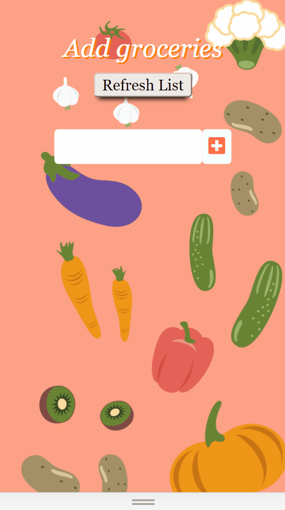

# MyKart

# Created By:

Teodora Soffronova

# What is MyKart?

MyKart is an app, created with React, used for shopping lists.

# Description of the main parts and functionalities of the project

MyKart is a simple, but helpful app, which can be used in daily tasks we all do ,like shopping.

Upon opening the app, the user will se a button "New list", which leads to a page with an input box, in which he can add the groceries he needs.

After this, the user can add the items needed, check them off the list, when he gets them and, if needed, delete them.
In case a new list is required, there is an "Refresh List" button, which deletes the whole list.

